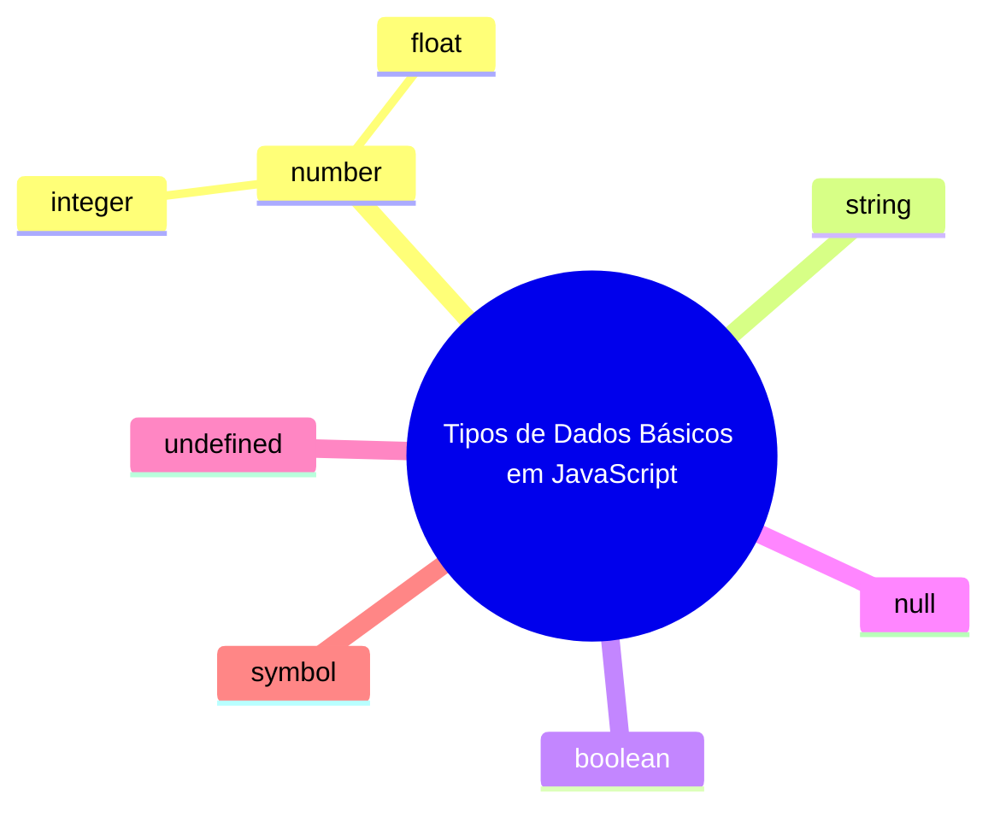
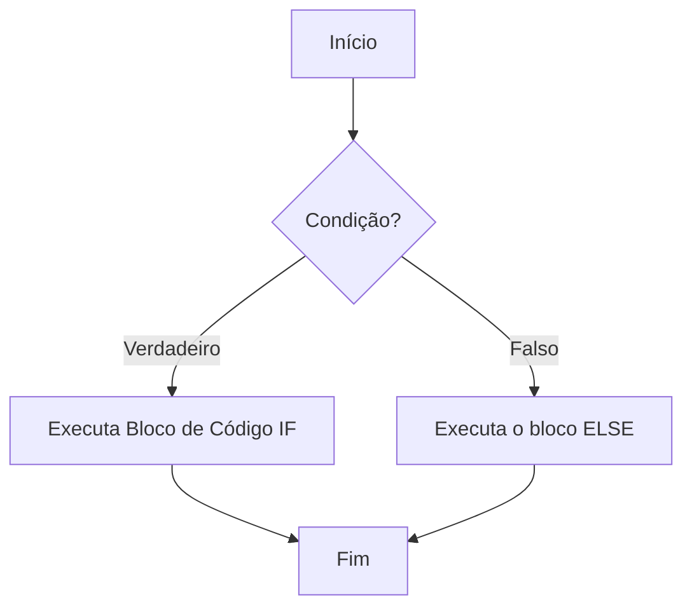

# Conceitos Fundamentais JavaScript - Guia Completo

##

### 📊 Tipos de Dados em JavaScript

JavaScript é uma linguagem **dinamicamente tipada**, ou seja, você não precisa declarar o tipo da variável - o JavaScript determina automaticamente.



####

#### Tipos Primitivos

**1. Number (Número)**

Representa tanto números inteiros quanto decimais.

```javascript
let idade = 25;           // Inteiro
let preco = 19.99;        // Decimal
let negativo = -10;       // Negativo
let infinito = Infinity;  // Infinito
let naoNumero = NaN;      // Not a Number
```

**2. String (Texto)**

Sequência de caracteres delimitada por aspas.

```javascript
let nome = "João";          // Aspas duplas
let sobrenome = 'Silva';    // Aspas simples
let frase = `Olá, ${nome}`; // Template literals (backticks)
```

**3. Boolean (Booleano)**

Representa verdadeiro ou falso.

```javascript
let ativo = true;
let inativo = false;
let maiorIdade = idade >= 18; // Resultado de comparação
```

**4. Undefined**

Variável declarada mas não inicializada.

```javascript
let variavelNaoInicializada;
console.log(variavelNaoInicializada); // undefined
```

**5. Null**

Representa ausência intencional de valor.

```javascript
let valorNulo = null;
```

**6. Symbol (ES6+)**

Identificador único.

```javascript
let simbolo = Symbol('id');
```

**7. BigInt (ES2020+)**

Para números muito grandes.

```javascript
let numeroGigante = 123456789012345678901234567890n;
```

#### Tipos Não-Primitivos

**Object (Objeto)**

Estrutura de dados complexa que inclui arrays, funções, datas, etc.

```javascript
// Objeto literal
let pessoa = {
    nome: "Maria",
    idade: 30,
    ativo: true
};

// Array
let numeros = [1, 2, 3, 4, 5];

// Função
function saudacao() {
    return "Olá!";
}

// Data
let hoje = new Date();
```

#### Verificando Tipos

```javascript
console.log(typeof 42);        // "number"
console.log(typeof "texto");   // "string"
console.log(typeof true);      // "boolean"
console.log(typeof undefined); // "undefined"
console.log(typeof null);      // "object" (peculiaridade do JS)
console.log(typeof {});        // "object"
console.log(typeof []);        // "object"
console.log(typeof function(){}); // "function"
```

***

### ➡️ Operadores de Atribuição

Operadores usados para atribuir valores às variáveis.

#### Atribuição Simples

```javascript
let x = 10;        // Atribui 10 à variável x
let nome = "Ana";  // Atribui "Ana" à variável nome
```

#### Atribuições Compostas

```javascript
let numero = 10;

numero += 5;  // numero = numero + 5  → 15
numero -= 3;  // numero = numero - 3  → 12
numero *= 2;  // numero = numero * 2  → 24
numero /= 4;  // numero = numero / 4  → 6
numero %= 3;  // numero = numero % 3  → 0 (resto da divisão)
numero **= 2; // numero = numero ** 2 → 0 (exponenciação)
```

#### Atribuição com Strings

```javascript
let texto = "Olá";
texto += " mundo";  // texto = texto + " mundo" → "Olá mundo"
```

***

### 🔢 Operadores Aritméticos

Operadores para realizar cálculos matemáticos.

#### Operadores Básicos

```javascript
let a = 10;
let b = 3;

console.log(a + b);  // Soma: 13
console.log(a - b);  // Subtração: 7
console.log(a * b);  // Multiplicação: 30
console.log(a / b);  // Divisão: 3.333...
console.log(a % b);  // Módulo (resto): 1
console.log(a ** b); // Exponenciação: 1000
```

#### Operadores de Incremento e Decremento

```javascript
let contador = 5;

// Pré-incremento (incrementa antes de usar)
console.log(++contador); // 6 (contador vira 6, depois mostra 6)

// Pós-incremento (usa depois incrementa)
console.log(contador++); // 6 (mostra 6, depois contador vira 7)

// Pré-decremento
console.log(--contador); // 6 (contador vira 6, depois mostra 6)

// Pós-decremento
console.log(contador--); // 6 (mostra 6, depois contador vira 5)
```

#### Precedência dos Operadores

```javascript
let resultado = 2 + 3 * 4;     // 14 (não 20, pois * tem precedência)
let resultado2 = (2 + 3) * 4;  // 20 (parênteses alteram a precedência)
```

***

### 🔍 Operadores Relacionais (Comparação)

Operadores que comparam valores e retornam `true` ou `false`.

#### Operadores de Igualdade

```javascript
let a = 5;
let b = "5";

// Igualdade simples (compara valor, converte tipos)
console.log(a == b);   // true (5 == "5")
console.log(a == 5);   // true

// Igualdade estrita (compara valor E tipo)
console.log(a === b);  // false (number !== string)
console.log(a === 5);  // true

// Desigualdade simples
console.log(a != b);   // false

// Desigualdade estrita
console.log(a !== b);  // true (tipos diferentes)
```

#### Operadores de Comparação

```javascript
let x = 10;
let y = 20;

console.log(x > y);   // false (10 > 20)
console.log(x < y);   // true  (10 < 20)
console.log(x >= 10); // true  (10 >= 10)
console.log(x <= 5);  // false (10 <= 5)
```

#### Comparação com Strings

```javascript
console.log("a" < "b");     // true (ordem alfabética)
console.log("apple" < "banana"); // true
console.log("10" < "9");    // true (comparação lexicográfica, não numérica)
```

***

## Operadores Lógicos em JavaScript

Os operadores lógicos em JavaScript são usados para combinar ou manipular valores booleanos. Aqui estão os principais:

### 1. AND Lógico (`&&`)

Retorna `true` apenas se ambos os operandos forem verdadeiros.

```javascript
let a = true;
let b = false;

console.log(a && b); // false
console.log(true && true); // true
console.log(5 > 3 && 10 < 20); // true
```

### 2. OR Lógico (`||`)

Retorna `true` se pelo menos um dos operandos for verdadeiro.

```javascript
let x = true;
let y = false;

console.log(x || y); // true
console.log(false || false); // false
console.log(5 > 10 || 3 < 7); // true
```

### 3. NOT Lógico (`!`)

Inverte o valor booleano (negação).

```javascript
let verdade = true;
let mentira = false;

console.log(!verdade); // false
console.log(!mentira); // true
console.log(!(5 > 3)); // false
```

### Exemplos Práticos

#### Verificação de Condições Múltiplas

```javascript
// Verificando idade e habilitação
let idade = 20;
let temHabilitacao = true;

if (idade >= 18 && temHabilitacao) {
    console.log("Pode dirigir");
} else {
    console.log("Não pode dirigir");
}
```

#### Verificação de Permissões

```javascript
// Verificando acesso
let isAdmin = false;
let isOwner = true;

if (isAdmin || isOwner) {
    console.log("Acesso liberado");
}
```

#### Validação de Campos

```javascript
// Validação de campo
let nome = "";
if (!nome) {
    console.log("Nome é obrigatório");
}
```

### Short-Circuit Evaluation

JavaScript usa avaliação de curto-circuito, o que significa que a avaliação para assim que o resultado é determinado:

```javascript
// Com &&: se o primeiro for false, não avalia o segundo
false && console.log("Não será executado");

// Com ||: se o primeiro for true, não avalia o segundo
true || console.log("Não será executado");
```

#### Uso Prático para Valores Padrão

```javascript
let usuario = null;
let nomeUsuario = usuario || "Anônimo";
console.log(nomeUsuario); // "Anônimo"

// Ou com o operador nullish coalescing (??)
let config = null;
let tema = config ?? "claro";
console.log(tema); // "claro"
```

### Tabela Resumo

| Operador | Nome | Descrição                                  | Exemplo                    |
| -------- | ---- | ------------------------------------------ | -------------------------- |
| `&&`     | AND  | Verdadeiro se ambos forem verdadeiros      | `true && false` → `false`  |
| `\|\|`   | OR   | Verdadeiro se pelo menos um for verdadeiro | `true \|\| false` → `true` |
| `!`      | NOT  | Inverte o valor booleano                   | `!true` → `false`          |

### Dicas Importantes

* Use parênteses para deixar a precedência clara: `(a && b) || c`
* Lembre-se que valores "falsy" incluem: `false`, `0`, `""`, `null`, `undefined`, `NaN`
* Valores "truthy" são todos os outros valores, incluindo arrays vazios `[]` e objetos vazios `{}`
* O operador `&&` pode ser usado para execução condicional: `condicao && funcao()`
* O operador `||` pode ser usado para valores padrão: `valor || padrão`

***


### 🔀 Estruturas de Desvio Condicional

Estruturas que permitem executar código condicionalmente.

#### 1. **if / else**

**Estrutura Básica**

```javascript
let idade = 18;

console.log("Início do exemplo com IF");

if (idade >= 18) {
  console.log("Você é maior de idade. Pode dirigir!");
}
```


**Estrutura if / else**

```javascript
let temperatura = 15;

console.log("Início do exemplo com IF-ELSE");

if (temperatura > 25) {
  console.log("Está calor! Use roupas leves.");
} else {
  console.log("A temperatura está agradável ou fria.");
}

```



**if / else if / else**

```javascript
let nota = 85;

if (nota >= 90) {
    console.log("A - Excelente");
} else if (nota >= 80) {
    console.log("B - Bom");
} else if (nota >= 70) {
    console.log("C - Regular");
} else if (nota >= 60) {
    console.log("D - Suficiente");
} else {
    console.log("F - Insuficiente");
}
```

**Condições Compostas**

```javascript
let idade = 25;
let temCarteira = true;

if (idade >= 18 && temCarteira) {
    console.log("Pode dirigir");
} else if (idade >= 18 && !temCarteira) {
    console.log("Precisa tirar carteira");
} else {
    console.log("Muito jovem para dirigir");
}
```

#### 2. **Operador Ternário**

Forma concisa de if/else para casos simples.

```javascript
// Sintaxe: condição ? valorSeVerdadeiro : valorSeFalso
let idade = 20;
let status = idade >= 18 ? "adulto" : "menor";

// Exemplo prático
let desconto = compra > 100 ? 0.1 : 0;
let mensagem = usuario ? `Bem-vindo, ${usuario}` : "Faça login";
```

#### 3. **switch / case**

Ideal para múltiplas comparações com o mesmo valor.

```javascript
let diaSemana = 3;
let nomeDia;

switch (diaSemana) {
    case 1:
        nomeDia = "Segunda";
        break;
    case 2:
        nomeDia = "Terça";
        break;
    case 3:
        nomeDia = "Quarta";
        break;
    case 4:
        nomeDia = "Quinta";
        break;
    case 5:
        nomeDia = "Sexta";
        break;
    case 6:
        nomeDia = "Sábado";
        break;
    case 7:
        nomeDia = "Domingo";
        break;
    default:
        nomeDia = "Dia inválido";
}
```

**switch com Agrupamento**

```javascript
let mes = 12;
let estacao;

switch (mes) {
    case 12:
    case 1:
    case 2:
        estacao = "Verão";
        break;
    case 3:
    case 4:
    case 5:
        estacao = "Outono";
        break;
    case 6:
    case 7:
    case 8:
        estacao = "Inverno";
        break;
    case 9:
    case 10:
    case 11:
        estacao = "Primavera";
        break;
    default:
        estacao = "Mês inválido";
}
```

***

### 💡 Conceitos Importantes

#### Valores Falsy e Truthy

Em JavaScript, alguns valores são considerados "falsy" (falsos) em contextos booleanos:

```javascript
// Valores FALSY (são considerados false)
if (false) { }        // false literal
if (0) { }           // zero
if (-0) { }          // zero negativo
if (0n) { }          // BigInt zero
if ("") { }          // string vazia
if (null) { }        // null
if (undefined) { }   // undefined
if (NaN) { }         // Not a Number

// Todos os outros valores são TRUTHY
if (1) { }           // true
if ("texto") { }     // true
if ([]) { }          // true (array vazio)
if ({}) { }          // true (objeto vazio)
```

#### Coerção de Tipos

JavaScript automaticamente converte tipos quando necessário:

```javascript
console.log("5" + 3);    // "53" (concatenação)
console.log("5" - 3);    // 2 (conversão para número)
console.log("5" * 3);    // 15 (conversão para número)
console.log(true + 1);   // 2 (true vira 1)
console.log(false + 1);  // 1 (false vira 0)
```

#### Operadores Lógicos

```javascript
// AND (&&) - Retorna o primeiro falsy ou o último valor
console.log(true && true && "resultado");   // "resultado"
console.log(true && false && "não chega"); // false

// OR (||) - Retorna o primeiro truthy ou o último valor
console.log(false || 0 || "default");      // "default"
console.log("primeiro" || "segundo");      // "primeiro"

// NOT (!) - Inverte o valor booleano
console.log(!true);      // false
console.log(!"texto");   // false
console.log(!!"texto");  // true (conversão para boolean)
```

***

### 🎯 Exemplos Práticos

#### Validação de Formulário

```javascript
function validarUsuario(nome, idade, email) {
    if (!nome || nome.length < 2) {
        return "Nome deve ter pelo menos 2 caracteres";
    }
    
    if (typeof idade !== "number" || idade < 0 || idade > 120) {
        return "Idade inválida";
    }
    
    if (!email || !email.includes("@")) {
        return "Email inválido";
    }
    
    return "Usuário válido";
}
```

#### Sistema de Desconto

```javascript
function calcularDesconto(valorCompra, tipoCliente) {
    let desconto = 0;
    
    switch (tipoCliente) {
        case "vip":
            desconto = 0.2; // 20%
            break;
        case "premium":
            desconto = 0.15; // 15%
            break;
        case "regular":
            desconto = 0.05; // 5%
            break;
        default:
            desconto = 0;
    }
    
    // Desconto adicional por valor
    if (valorCompra > 1000) {
        desconto += 0.05; // +5%
    }
    
    return valorCompra * (1 - desconto);
}
```

Estes conceitos formam a base fundamental do JavaScript. Dominar tipos de dados, operadores e estruturas condicionais é essencial para resolver problemas e criar lógicas mais complexas!
