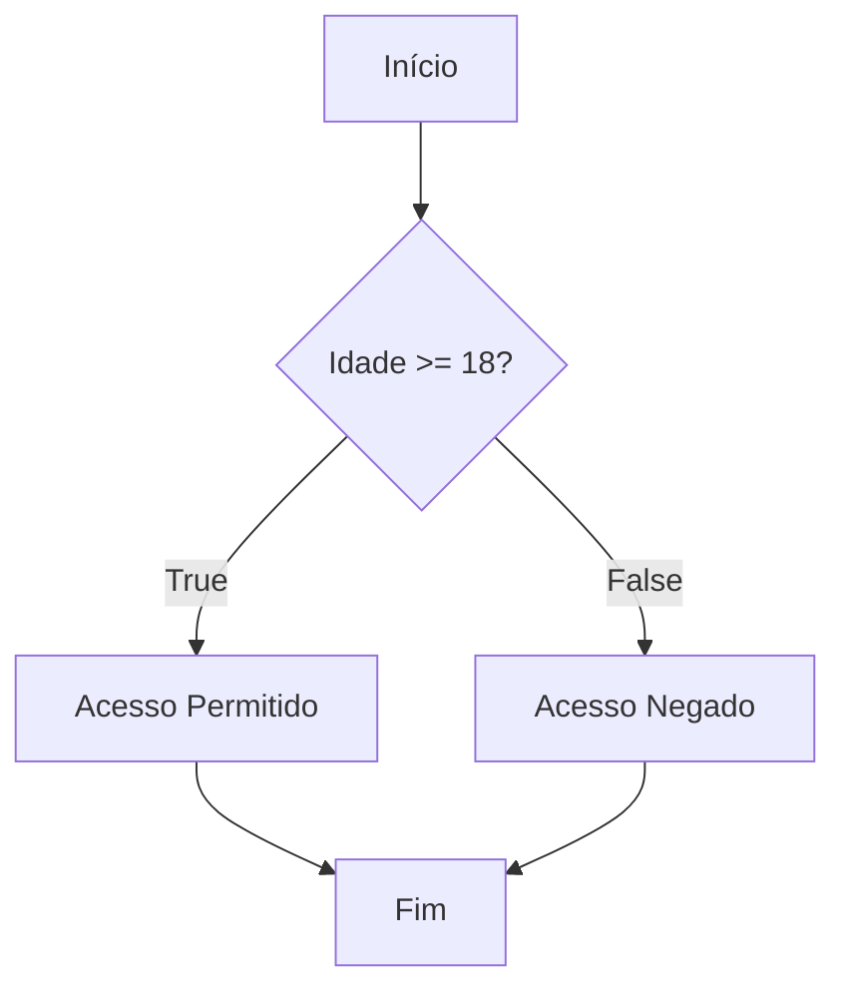

# Controle de Fluxo com if

## Controle de Fluxo em JavaScript

### A Estrutura `if / else`

***

### O que é Controle de Fluxo?

Imagine que seu código é um caminho. O controle de fluxo permite que o programa **tome decisões** e escolha qual caminho seguir.

É como dar inteligência ao nosso programa!

* Executar um código somente se uma condição for atendida.
* Escolher entre diferentes blocos de código.
* Repetir uma ação várias vezes (veremos isso em aulas futuras!).

***

### O `if` (Se)

O `if` é a forma mais simples de decisão. Ele executa um bloco de código **apenas se** uma condição for **verdadeira** (`true`).

**Sintaxe:**

```javascript
if (condicao) {
  // Este código só executa se a 'condicao' for verdadeira
}
```

***

#### `if`: Exemplo Prático

Vamos verificar a idade para entrar em um evento para maiores de 18 anos.

```javascript
let idade = 25;

if (idade >= 18) {
  console.log("Acesso permitido! Bem-vindo(a) à festa. 🎉");
}

// Se a idade fosse 16, nada aconteceria.
```

***

### O `else` (Senão)

E se a condição do `if` for **falsa**? O `else` nos dá um caminho alternativo. Ele executa um bloco de código quando a condição do `if` **não** é atendida.

**Sintaxe:**

```javascript
if (condicao) {
  // Executa se a condição for verdadeira
} else {
  // Executa se a condição for falsa
}
```

***

#### `if/else`: Exemplo Prático

Completando nosso exemplo da festa.

```javascript
let idade = 16;

if (idade >= 18) {
  console.log("Acesso permitido! Bem-vindo(a) à festa. 🎉");
} else {
  console.log("Acesso negado. Evento para maiores de 18 anos. ⛔");
}
```

***



***

### O `else if`

Para múltiplas condições, usamos o `else if`. Ele permite testar uma nova condição se a anterior for falsa. Podemos ter vários `else if`.

**Sintaxe:**

```javascript
if (condicao1) {
  // Bloco 1
} else if (condicao2) {
  // Bloco 2
} else {
  // Bloco 3 (opcional)
}
```

***

#### `else if`: Exemplo Prático

Vamos classificar a nota de um aluno:

* **Aprovado:** nota >= 7
* **Recuperação:** nota >= 5
* **Reprovado:** nota < 5

```javascript
let nota = 6.5;

if (nota >= 7) {
  console.log("Aprovado! Parabéns! 🥳");
} else if (nota >= 5) {
  console.log("Recuperação. Você consegue! 👍");
} else {
  console.log("Reprovado. Estude mais um pouco. 📚");
}
// Resultado: Recuperação. Você consegue! 👍
```

***

### Resumo

* **`if`**: Executa um bloco se a condição for `true`.
* **`else`**: Executa um bloco se a condição do `if` for `false`.
* **`else if`**: Testa uma nova condição se a anterior for `false`.

Dominar o `if/else` é o primeiro passo para criar programas dinâmicos e inteligentes.

***

## Dúvidas?

**Bons estudos e até a próxima!** 🚀

```
```
