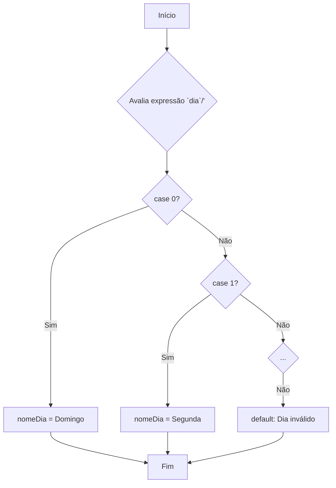

# Controle de fluxo com Switch

## Estrutura de Controle de Fluxo

### **switch** em JavaScript

***

### O que é o `switch`?

O comando `switch` é uma estrutura de controle que permite executar diferentes blocos de código com base no valor de uma expressão.

É uma alternativa mais limpa e organizada a uma sequência de `if...else if...else` quando estamos comparando uma única variável com múltiplos valores possíveis.

***

* **Expressão**: O valor que será avaliado.
* **`case`**: Cada um dos possíveis valores para a expressão.
* **`break`**: Impede a execução dos próximos `case` (fall-through).
* **`default`**: Código a ser executado se nenhum `case` corresponder.

***

### Sintaxe Básica

A sintaxe do `switch` é bem definida. A expressão é avaliada uma única vez e comparada com o valor de cada `case`.

```javascript
switch (expressao) {
  case valor1:
    // Código a ser executado se expressao === valor1
    break;
  case valor2:
    // Código a ser executado se expressao === valor2
    break;
  // ...outros cases
  default:
    // Código a ser executado se nenhum case corresponder
}
```

***

Exemplo Prático: Dias da Semana\
Vamos ver como usar o switch para descobrir o nome do dia da semana a partir de um número (0 = Domingo, 1 = Segunda, etc.).

***

```javascript

const dia = new Date().getDay();
let nomeDia;

switch (dia) {
  case 0:
    nomeDia = "Domingo";
    break;
  case 1:
    nomeDia = "Segunda-feira";
    break;
  case 2:
    nomeDia = "Terça-feira";
    break;
  case 3:
    nomeDia = "Quarta-feira";
    break;
  case 4:
    nomeDia = "Quinta-feira";
    break;
  case 5:
    nomeDia = "Sexta-feira";
    break;
  case 6:
    nomeDia = "Sábado";
    break;
  default:
    nomeDia = "Dia inválido";
}

console.log(`Hoje é ${nomeDia}.`);
```

***

Visualizando o Fluxo com Mermaid\
Podemos usar um diagrama para entender melhor como o switch funciona.



```mermaid
```
