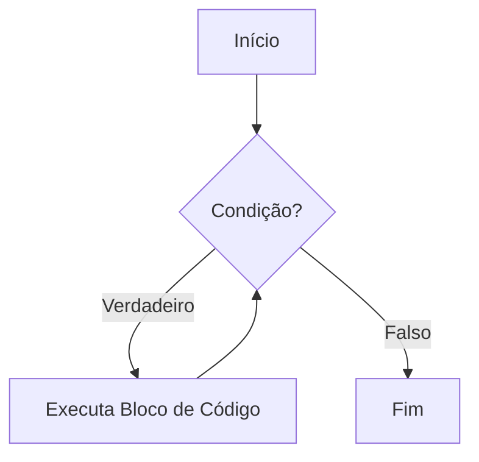
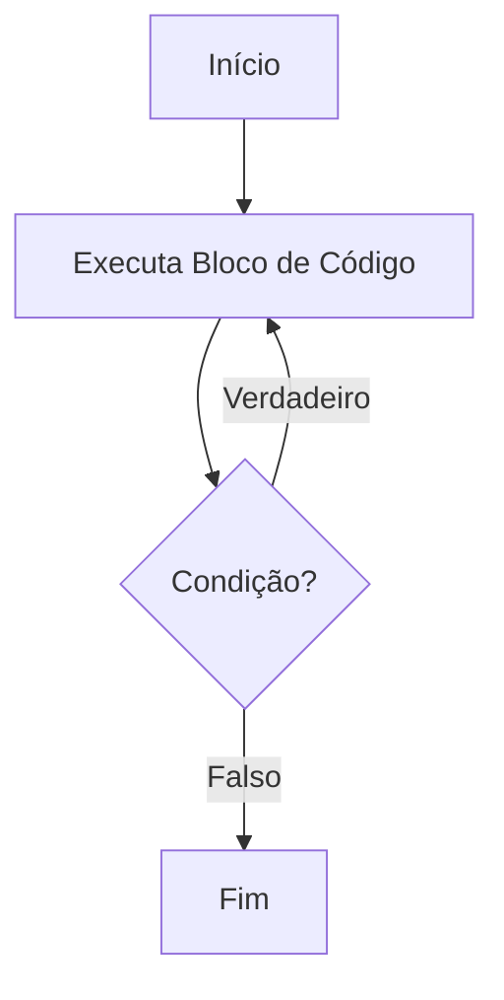

# Estruturas de repetição - While e Do-While

## Estruturas de Repetição `while` e `do-while` em JavaScript

Olá, pessoal! Hoje vamos aprender sobre duas ferramentas essenciais em programação: as estruturas de repetição **`while`** e **`do-while`**. Elas nos ajudam a fazer com que o computador repita tarefas várias vezes.

***

### 1. `while` (Enquanto)

A estrutura **`while`** faz um bloco de código se repetir _enquanto_ uma condição for verdadeira. Pense assim: "Enquanto isso for verdade, faça aquilo."

O detalhe importante é que ele **verifica a condição antes** de fazer qualquer coisa. Se a condição já for falsa no começo, o código lá dentro nem roda!

**Como funciona:**

JavaScript

```
while (condicao) {
  // Faça isso
  // (e lembre-se de mudar algo para a condição um dia se tornar falsa!)
}
```



**Exemplo Simples:**

Vamos contar de 1 até 3.

JavaScript

```
let numero = 1; // Começamos com o número 1

while (numero <= 3) { // Enquanto o número for menor ou igual a 3...
  console.log("Contando com while: " + numero); // Mostra o número
  numero++; // Aumenta o número em 1 (para um dia parar)
}
// Saída esperada:
// Contando com while: 1
// Contando com while: 2
// Contando com while: 3
```

**Ponto importante:** Se você esquecer de fazer o `numero++` (ou alguma coisa que mude a condição), o programa nunca para! Chamamos isso de **loop infinito**. Cuidado!

***

### 2. `do-while` (Faça-Enquanto)

A estrutura **`do-while`** é parecida com o `while`, mas tem uma diferença chave: ela **faz o código pelo menos uma vez** e só depois verifica a condição para saber se repete.

Pense assim: "Faça isso, e depois, enquanto for verdade, continue fazendo."

**Como funciona:**

JavaScript

```
do {
  // Faça isso (vai rodar pelo menos uma vez)
} while (condicao); // Depois de fazer, verifica a condição aqui
```



**Exemplo Simples:**

Vamos contar de 1 até 3 de novo, mas com `do-while`.

JavaScript

```
let outroNumero = 1; // Começamos com o número 1

do {
  console.log("Contando com do-while: " + outroNumero); // Mostra o número
  outroNumero++; // Aumenta o número em 1
} while (outroNumero <= 3); // Enquanto o número for menor ou igual a 3...
// Saída esperada:
// Contando com do-while: 1
// Contando com do-while: 2
// Contando com do-while: 3
```

**Qual a diferença real?**

Para ver a diferença na prática, observe este caso:

JavaScript

```
let valor = 5;

console.log("\n--- Comparando while vs do-while com condição falsa ---");

console.log("Exemplo com while:");
while (valor < 5) { // 5 não é menor que 5, então a condição é falsa
  console.log("Isso nunca vai aparecer (while)");
}

let outroValor = 5;
console.log("Exemplo com do-while:");
do {
  console.log("Isso vai aparecer uma vez! (do-while). Valor: " + outroValor);
} while (outroValor < 5); // 5 não é menor que 5, condição falsa após a 1ª vez
// Saída esperada:
// --- Comparando while vs do-while com condição falsa ---
// Exemplo com while:
// Exemplo com do-while:
// Isso vai aparecer uma vez! (do-while). Valor: 5
```

Percebeu? O `while` não mostrou nada porque a condição já era falsa. O `do-while`, por outro lado, mostrou a mensagem uma vez antes de verificar a condição e parar.

***

### 3. Quando usar qual?

* **Use `while` quando:** Você só quer que o código rode _se_ a condição for verdadeira desde o começo. Pode ser que ele nem rode nenhuma vez.
  * _Exemplo mental:_ "Enquanto tiver café na garrafa, sirva uma xícara." (Se a garrafa já estiver vazia, não serve nada.)
* **Use `do-while` quando:** Você quer que o código rode _pelo menos uma vez_, não importa o que aconteça, e só depois decida se repete.
  * _Exemplo mental:_ "Faça a prova uma vez, e enquanto você não tirar 7, faça de novo." (Você sempre faz a prova pelo menos uma vez.)

***

### Resumo e Próximos Passos

Nesta aula, vimos o **`while`** (verifica antes, pode não rodar) e o **`do-while`** (roda pelo menos uma vez, verifica depois). Ambos são ótimos para repetições.

No próximo encontro, vamos conhecer o **`for`**, outra estrutura de repetição muito usada, principalmente quando sabemos quantas vezes queremos repetir algo.

Até a próxima!

***
