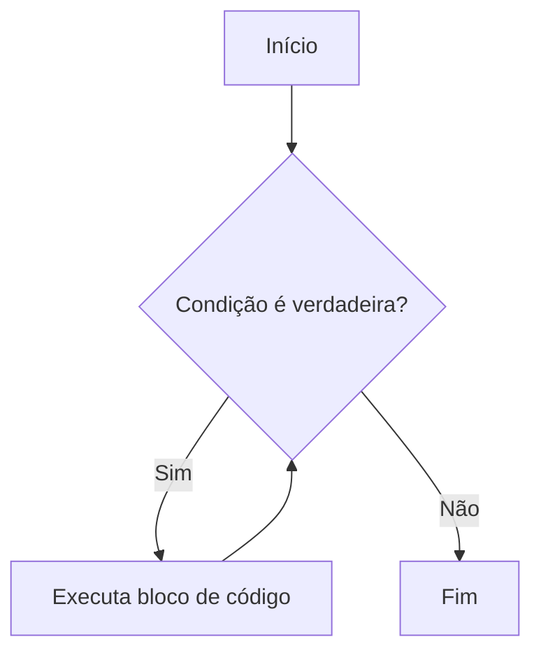
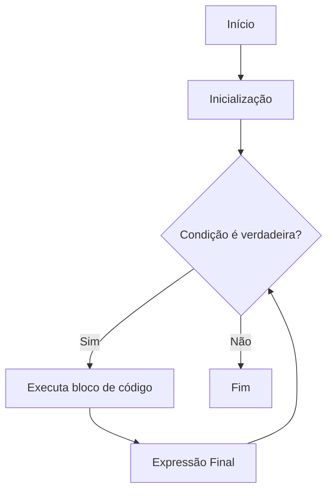

# Estruturas de Repetição

### 1. O que são Estruturas de Repetição?

Imagine que você precisa executar a mesma linha de código várias vezes. Escrever essa linha repetidamente seria cansativo, propenso a erros e nada eficiente, certo? É para resolver esse problema que as estruturas de repetição existem. Elas nos permitem executar um bloco de código repetidamente, enquanto uma determinada condição for verdadeira ou por um número específico de vezes.

Em termos simples, um laço (loop) é como um "faça de novo" programável. Ele verifica uma condição e, se ela for atendida, executa um conjunto de instruções e depois verifica a condição novamente. Esse processo se repete até que a condição não seja mais atendida.


### 2. A Estrutura `while` (Enquanto)

A estrutura `while` é uma das formas mais básicas de laço. Ela executa um bloco de código enquanto uma condição especificada for verdadeira. É como dizer: "Enquanto isso for verdade, faça aquilo."

A sintaxe básica do `while` em JavaScript é:

JavaScript

```javascript
while (condicao) {
  // Bloco de código a ser repetido
}
```

O fluxograma para a estrutura `while` ficaria assim:



### 3. Exercícios Elementares com `while`

Vamos praticar um pouco com alguns exercícios simples usando `while`.

#### Exercício 1: Contagem Progressiva

Escreva um programa que exiba os números de 1 a 5 no console.

**Solução:**

JavaScript

```javascript
let contador = 1;
while (contador <= 5) {
  console.log(contador);
  contador++; // Incrementa o contador para evitar loop infinito
}
```

***

#### Exercício 2: Soma de Números

Escreva um programa que some os números de 1 a 10.

**Solução:**

JavaScript

```javascript
let numero = 1;
let soma = 0;

while (numero <= 10) {
  soma = soma + numero; // Adiciona o número atual à soma
  numero++;
}
console.log("A soma dos números de 1 a 10 é:", soma);
```

***

#### Exercício 3: Contagem Regressiva

Crie um programa que faça uma contagem regressiva de 5 até 1 e depois exiba "Fogo!".

**Solução:**

JavaScript

```
let contagem = 5;
while (contagem >= 1) {
  console.log(contagem);
  contagem--; // Decrementa a contagem
}
console.log("Fogo!");
```

***

### 4. Iterando sobre Coleções com `for` e `Array`

Muitas vezes, precisamos percorrer uma lista de itens, como uma lista de nomes, notas de alunos ou produtos. Em programação, essas listas são frequentemente representadas por coleções de dados, e uma das mais comuns em JavaScript é o Array.

Um `Array` é um tipo de estrutura de dados que permite armazenar múltiplos valores em uma única variável, organizados por um índice numérico que começa em 0.

Por exemplo, um array de frutas pode ser:

JavaScript

```javascript
let frutas = ["Maçã", "Banana", "Laranja", "Uva"];
```

Para percorrer (ou iterar) sobre cada item de um `Array`, a estrutura `while` pode ser usada, mas a estrutura `for` é geralmente mais adequada e concisa para esses cenários, pois ela já incorpora a inicialização, a condição e a atualização em sua própria sintaxe.

***

### 5. A Estrutura `for`

A estrutura `for` é ideal para situações onde sabemos (ou podemos determinar) o número exato de vezes que um bloco de código precisa ser executado. Ela é composta por três partes principais em sua declaração:

1. Inicialização: Executada apenas uma vez no início do laço, geralmente para declarar e inicializar uma variável de controle.
2. Condição: Avaliada antes de cada iteração. Se for verdadeira, o bloco de código é executado. Se for falsa, o laço termina.
3. Expressão Final: Executada após cada iteração do bloco de código, geralmente para atualizar a variável de controle (incrementar ou decrementar).

A sintaxe básica do `for` em JavaScript é:

JavaScript

```javascript
for (inicializacao; condicao; expressaoFinal) {
  // Bloco de código a ser repetido
}
```

O fluxograma para a estrutura `for` ficaria assim:



#### Exercícios Elementares com `for`

Vamos ver o `for` em ação com alguns exemplos:

#### Exercício 1: Exibir Números de 1 a 10

Escreva um programa que exiba os números de 1 a 10 no console usando `for`.

**Solução:**

JavaScript

```javascript
for (let i = 1; i <= 10; i++) {
  console.log(i);
}
```

***

#### Exercício 2: Percorrer um Array de Nomes

Crie um array com alguns nomes e exiba cada nome no console.

**Solução:**

JavaScript

```javascript
let nomes = ["Alice", "Bob", "Carlos", "Diana"];

for (let i = 0; i < nomes.length; i++) {
  console.log(nomes[i]); // Acessa o elemento do array pelo índice
}
```

***

#### Exercício 3: Soma dos Elementos de um Array

Dado um array de números, calcule a soma de todos os seus elementos.

**Solução:**

JavaScript

```javascript
let numeros = [10, 20, 30, 40, 50];
let somaArray = 0;

for (let i = 0; i < numeros.length; i++) {
  somaArray = somaArray + numeros[i];
}
console.log("A soma dos elementos do array é:", somaArray);
```

***

Espero que esta introdução às estruturas de repetição `while` e `for` tenha sido clara e útil! Elas são ferramentas poderosas no seu arsenal de programação. Entender como e quando usar cada uma delas é crucial para escrever códigos eficientes e elegantes.
